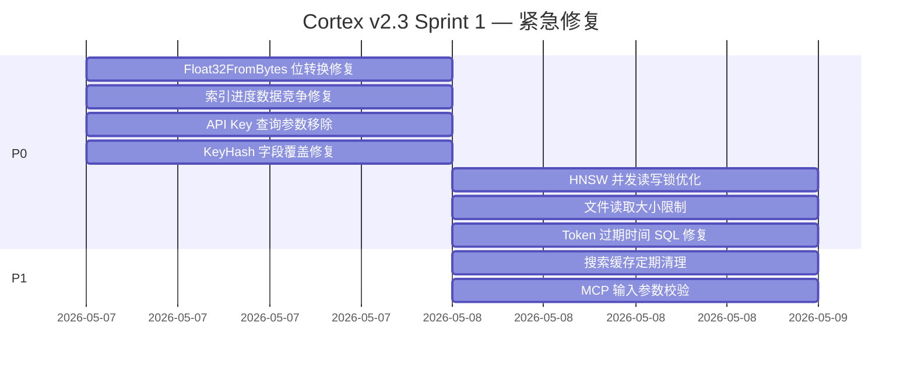
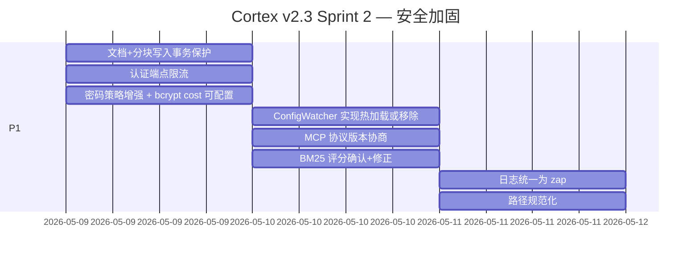
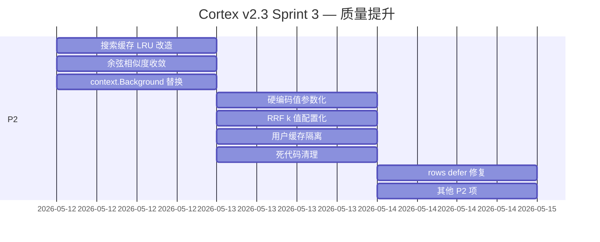
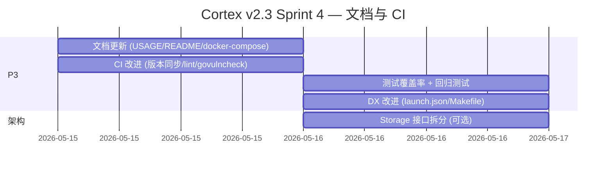

# 🧠 Cortex v2.3 迭代升级方案

> **基于全面系统评估生成的迭代路线图**  
> **评估日期**: 2026-05-06 | **评估范围**: 54 个 Go 源文件, ~11,500 行代码  
> **当前版本**: v2.2 | **目标版本**: v2.3  
> **评估方法**: 代码审查 + 114 个单元测试 + `go vet` 静态分析 + 30 项功能测试 (96.7% 通过率)

---

## 目录

- [问题总览](#问题总览)
- [P0 — 紧急修复 (Critical Bugs)](#p0--紧急修复-critical-bugs)
- [P1 — 高优先级 (Security & Stability)](#p1--高优先级-security--stability)
- [P2 — 中优先级 (Quality & Performance)](#p2--中优先级-quality--performance)
- [P3 — 低优先级 (Polish & DX)](#p3--低优先级-polish--dx)
- [迭代路线图](#迭代路线图)
- [风险与依赖](#风险与依赖)

---

## 问题总览

本次评估共发现 **53 项可优化问题**，按严重度分布：

| 等级 | 数量 | 占比 |
|:----:|:----:|:----:|
| 🔴 **P0 — 紧急** | 7 | 13% |
| 🟠 **P1 — 高优** | 10 | 19% |
| 🟡 **P2 — 中优** | 12 | 23% |
| 🟢 **P3 — 低优** | 12 | 23% |
| 📐 **架构层面** | 6 | 11% |
| 🔌 **MCP 协议** | 3 | 6% |
| 🔍 **搜索/向量** | 3 | 6% |

---

## P0 — 紧急修复 (Critical Bugs)

这些 Bug **直接影响正确性**，必须在下一个补丁中修复。

### 0.1 `Float32FromBytes` 位转换错误 🚨

| 项目 | 内容 |
|------|------|
| **文件** | `internal/vector/storage_bridge.go:125-128` |
| **问题** | `float32(bits)` 直接将 uint32 值转为 float32，而不是用 `math.Float32frombits` 重新解释 IEEE 754 位模式。例如 `0x3f800000` (代表 1.0) 会被转成 `1065353216.0` |
| **影响** | **向量搜索返回的数值完全错误**，HNSW 索引从数据库加载后匹配结果无意义 |
| **修复** | 替换为 `math.Float32frombits(binary.LittleEndian.Uint32(b))` |

```diff
 func Float32FromBytes(b []byte) float32 {
-    bits := uint32(b[0]) | uint32(b[1])<<8 | uint32(b[2])<<16 | uint32(b[3])<<24
-    return float32(bits)
+    bits := binary.LittleEndian.Uint32(b)
+    return math.Float32frombits(bits)
 }
```

### 0.2 索引进度数据竞争 🚨

| 项目 | 内容 |
|------|------|
| **文件** | `internal/index/indexer.go:178-229` |
| **问题** | `IndexDirectoryWithCheckpoint` 在提交 goroutine 的同时从 `resultCh` 中 drain 数据，且 `len(resultCh)` 读取的是缓冲区容量而非元素数。`progress.IndexedFiles` 等字段在多个 goroutine 中无锁并发更新 |
| **影响** | 索引进度统计不准确，偶发丢失索引结果 |
| **修复** | 使用 `sync/atomic` 计数器 + 仅在 `wg.Wait()` 完成后 collect 结果 |

### 0.3 API Key 可通过 URL 查询参数传递 🚨

| 项目 | 内容 |
|------|------|
| **文件** | `internal/api/auth.go:109` |
| **问题** | API Key 可通过 `?api_key=xxx` 传递，会出现在访问日志、浏览器历史、Referer 头中 |
| **影响** | **安全风险**：密钥可能被意外泄露 |
| **修复** | 移除 Query 参数 fallback，仅接受 `Authorization: Bearer` 或自定义 Header |

### 0.4 `KeyHash` 字段被原始 Key 覆盖 🚨

| 项目 | 内容 |
|------|------|
| **文件** | `internal/auth/service.go:185-203` |
| **问题** | 创建 API Key 后，`KeyHash` 字段被覆盖为原始 Key 用于返回，但该字段同时也被序列化 |
| **影响** | 响应中可能包含完整 API Key |
| **修复** | 使用独立的 `RawKey` 字段返回原始 Key |

### 0.5 HNSW 并发读写竞争 🚨

| 项目 | 内容 |
|------|------|
| **文件** | `internal/vector/hnsw.go:134-263` |
| **问题** | `Add()` 在 `insertAtLevel` 中修改 `neighbors` 时，`Search()` 可能通过 `searchLayer` 并发读取，且缺少边界检查 |
| **影响** | 偶发表索引越界 panic |
| **修复** | 添加边界检查 + 考虑粒度更细的读写锁 |

### 0.6 无限制的文件读取 🚨

| 项目 | 内容 |
|------|------|
| **文件** | `internal/index/indexer.go:325` |
| **问题** | `os.ReadFile(path)` 无文件大小限制，10GB 文件将导致 OOM |
| **影响** | 进程崩溃 |
| **修复** | 读取前检查 `os.Stat().Size()`，跳过超限文件 |

### 0.7 Token 过期时间 SQL 格式错误 🚨

| 项目 | 内容 |
|------|------|
| **文件** | `internal/storage/crud.go:471-480` |
| **问题** | SQL 中 `datetime(expires_at, 'unixepoch')` 期望 Unix 时间戳整数，但 Go 传入 `time.Time` 对象，SQLite 会将其转为 RFC3339 字符串导致 `datetime()` 解析错误 |
| **影响** | Token 过期时间计算错误，认证可能提前或延迟失效 |
| **修复** | 传入 `expiresAt.Unix()` 整数 |

---

## P1 — 高优先级 (Security & Stability)

### 1.1 搜索缓存无限增长 🟠

| 文件 | 问题 | 修复 |
|------|------|------|
| `internal/storage/cache.go:71` | `search_cache` 表 `CleanupExpiredCache()` 从未被调用 | 启动定期清理 goroutine 或添加 LRU 限制 |

### 1.2 文档 + 分块写入无事务保护 🟠

| 文件 | 问题 | 修复 |
|------|------|------|
| `internal/storage/crud.go:12-150` | `SaveDocument` + `SaveChunks` 分开调用，部分失败产生孤立文档 | 添加原子性的 `SaveDocumentWithChunks` 事务方法 |

### 1.3 MCP 缺少输入参数校验 🟠

| 文件 | 问题 | 修复 |
|------|------|------|
| `internal/api/mcp.go:132` | `handleSearchTool` 不验证空 Query，与 REST 行为不一致 | 添加空值检查 |

### 1.4 认证端点无暴力破解防护 🟠

| 文件 | 问题 | 修复 |
|------|------|------|
| `internal/api/rest.go:179-184` | `/auth/login` 和 `/auth/register` 无 IP 级限流 | 添加 per-IP rate limiter |

### 1.5 密码策略过弱 🟠

| 文件 | 问题 | 修复 |
|------|------|------|
| `internal/models/types.go:51` | 最小 6 位密码无复杂度要求 | 提升到 8 位 + 复杂度校验 |

### 1.6 `ConfigWatcher.watch()` 空转浪费 CPU 🟠

| 文件 | 问题 | 修复 |
|------|------|------|
| `internal/config/config.go:205-221` | 每 1 秒唤醒的空循环，不做任何事 | 实现真正的热加载或移除该 goroutine |

### 1.7 MCP 协议版本未协商 🟠

| 文件 | 问题 | 修复 |
|------|------|------|
| `internal/api/mcp.go:21` | `MCPProtocolVersion` 声明了但未使用 | 在初始化时设置版本并实现协商 |

### 1.8 BM25 评分解释方向可能错误 🟠

| 文件 | 问题 | 修复 |
|------|------|------|
| `internal/storage/search.go:38-46` | `math.Abs(rawScore)` 处理 BM25 分数逻辑存疑 | 确认 BM25 含义并采用正确归一化 |

### 1.9 `log.Printf` 替代结构化日志 🟠

| 涉及文件 | 问题 | 修复 |
|---------|------|------|
| `sqlite.go`, `indexer.go`, `watcher.go`, `index_progress.go` | 混用 `log.Printf` 和 `zap.Logger` | 统一为 `zap.Logger` |

### 1.10 路径遍历风险 🟠

| 文件 | 问题 | 修复 |
|------|------|------|
| `internal/index/indexer.go:261` | `IndexDirectory` 未路径规范化 | 使用 `filepath.Clean` + 拒绝 `..` 路径 |

---

## P2 — 中优先级 (Quality & Performance)

### 2.1 搜索缓存 evict 随机而非最旧 🟡

| 文件 | 修复建议 |
|------|---------|
| `internal/search/cache.go:63-74` | 改用 LRU 算法或维护插入顺序链表 |

### 2.2 重复的余弦相似度实现 🟡

| 文件 | 修复建议 |
|------|---------|
| `internal/storage/search.go:255-271` + `internal/vector/hnsw.go:98-110` | 收敛到共享工具包 |

### 2.3 `context.Background()` 替代请求上下文 🟡

| 文件 | 修复建议 |
|------|---------|
| `internal/api/rest.go:376`, `internal/embedding/onnx.go:87` | 改为 `c.Request.Context()` |

### 2.4 RRF k 值硬编码 🟡

| 文件 | 修复建议 |
|------|---------|
| `internal/search/engine.go:176` | 移到配置文件中 |

### 2.5 `InvalidateUserSearchCache` 清空所有用户缓存 🟡

| 文件 | 修复建议 |
|------|---------|
| `internal/storage/cache.go:87-92` | 添加 `user_id` 列到 `search_cache` 表 |

### 2.6 死代码清理 🟡

| 函数 | 文件 | 操作 |
|------|------|------|
| `constantTimeCompare` | `internal/api/auth.go:120` | 删除（未使用） |
| `joinStrings` | `internal/storage/search.go:240` | 删除（SQL 注入风险） |
| `logDegraded` | `internal/storage/search.go:71` | 删除或实现实际日志 |
| `ConfigWatcher.watch` | `internal/config/config.go:205` | 删除或实现热加载 |

### 2.7 硬编码值参数化 🟡

| 值 | 当前值 | 建议 |
|----|-------|------|
| 默认限流 | 100/s, burst 200 | 移到配置 |
| 超时时间 | 30s / 60s / 5min | 移到配置 |
| 最大缓存条目 | 10,000 | 移到配置 |
| MCP 版本字符串 | "v1.0.0" | 使用 `-ldflags` 注入 |
| bcrypt cost | 10 | 移到配置 |

### 2.8 `rows.Close()` 缺乏 `defer` 保护 🟡

| 文件 | 修复建议 |
|------|---------|
| `internal/storage/search.go:109-125` | 在 `db.Query` 后立即 `defer rows.Close()` |

### 2.9 Prometheus 指标无注销机制 🟡

| 文件 | 修复建议 |
|------|---------|
| `internal/metrics/metrics.go` | 使用自定义 registry |

### 2.10 嵌入错误被静默吞噬 🟡

| 文件 | 修复建议 |
|------|---------|
| `internal/storage/memory.go:82` | 记录 embedding 失败日志，返回降级结果 |

### 2.11 全局 Logger 构建错误被忽略 🟡

| 文件 | 修复建议 |
|------|---------|
| `internal/log/logger.go:19` | 使用 `cfg.Build().MustBuild()` 或显式处理 |

### 2.12 WAL 备份错误静默忽略 🟡

| 文件 | 修复建议 |
|------|---------|
| `internal/storage/backup.go:42` | 至少记录日志 |

---

## P3 — 低优先级 (Polish & DX)

### 3.1 文档改进

| 项目 | 当前问题 | 改进 |
|------|---------|------|
| `USAGE_GUIDE.md` | MCP 配置 OSS 格式使用 `mcpServers` 而非 `mcp` | 更新为 OpenCode 标准格式 |
| `README.md` | 缺少 MCP 工具使用示例 | 补充各工具调用示例 |
| `docker-compose.yml` | 版本声明 `3.8` 已弃用 | 升级格式 |
| `Makefile` | 缺少 vet/lint/security 检查 | 添加 `make check` / `make security` |
| `CONTRIBUTING.md` | 缺少 PR 验收标准 | 补充代码质量和测试要求 |

### 3.2 CI 改进

| 当前问题 | 改进建议 |
|---------|---------|
| `build.yml` Go 版本 `1.22, 1.23` 与 `go.mod` 的 `1.25.0` 不匹配 | 同步版本 |
| `report-card.yml` 仅 POST 到 goreportcard，不运行测试 | 添加 `go test ./...` |
| 缺少 `govulncheck` | 添加 Go 漏洞扫描步骤 |
| 缺少 lint 步骤 | 添加 `golangci-lint` |
| Release notes 硬编码 | 使用 GitHub Changelog 自动生成 |

### 3.3 测试增强

| 当前问题 | 改进建议 |
|---------|---------|
| 测试覆盖率无度量 | 添加 `go test -coverprofile` + CI 报告 |
| MCP 测试 11 个，覆盖有限 | 增加边界条件测试（空参数、超长文本） |
| 无向量搜索集成测试 | 添加 `Float32FromBytes` 回归测试 |
| `mcp_test.go:200` 通配符路径 SQL 查询不工作 | 修正测试逻辑 |

### 3.4 开发者体验

| 改进 | 说明 |
|------|------|
| 添加 `.vscode/launch.json` | 一键启动 MCP/Serve 模式 |
| 添加 `Makefile` 的 `make dev` | 同时启动 Ollama + Cortex |
| 添加 `pre-commit` hook 配置 | 自动 go fmt + go vet |
| 添加 `go generate` 注释 | 自动生成版本号 |

---

## 迭代路线图

### Sprint 1: 紧急修复 (1-2 天)



**产出**: v2.3.0-beta.1 — 修复所有 P0 Bug

### Sprint 2: 安全与稳定性 (3-5 天)



**产出**: v2.3.0-beta.2 — 安全加固完成

### Sprint 3: 质量提升 (3-5 天)



**产出**: v2.3.0-rc.1 — 质量提升完成

### Sprint 4: 文档与 CI (2-3 天)



**产出**: v2.3.0 正式版

### 总体时间线

```
5/7 ─── Sprint 1 ─── 5/8    紧急修复 (P0)
                ↘
5/9 ─── Sprint 2 ─── 5/11   安全加固 (P1)
                ↘
5/12 ── Sprint 3 ─── 5/14   质量提升 (P2)
                ↘
5/15 ── Sprint 4 ─── 5/16   文档/CI (P3)
                ↘
           v2.3.0 发布
```

---

## 风险与依赖

### 技术风险

| 风险 | 概率 | 影响 | 缓解措施 |
|------|:----:|:----:|---------|
| `Float32FromBytes` 修复后向量搜索评分变化 | 高 | 中 | 编写精确的单元测试，用已知向量验证位转换 |
| HNSW 锁粒度调整引入死锁 | 中 | 高 | 代码审查 + 添加并发测试 |
| 搜索缓存改造迁移到 LRU 涉及数据迁移 | 中 | 低 | 旧缓存 TTL 到期自动失效 |

### 外部依赖

| 依赖 | 风险 | 替代方案 |
|------|------|---------|
| `modernc.org/sqlite` | 纯 Go SQLite，性能可能不如 C 实现 | CGO 编译 + `mattn/go-sqlite3` |
| `patrickmn/go-cache` | 已归档不再维护 | 替换为 `hashicorp/golang-lru` |
| `modelcontextprotocol/go-sdk` | 相对较新，API 可能变化 | 锁定 semver |
| `pdfcpu/pdfcpu` | PDF 解析能力有限 | 考虑 `unidoc` 或 PDF 提取专用工具 |

---

## 总结

```
P0 紧急 (7) ─── 必须修复，影响正确性
    ├── Float32FromBytes 位转换 ↯ 向量搜索完全错误
    ├── 索引进度数据竞争     ↯ 结果丢失
    ├── API Key URL 泄露     ↯ 安全风险
    ├── KeyHash 字段覆盖      ↯ 密钥泄露
    ├── HNSW 并发竞争        ↯ 偶发 panic
    ├── 无限制文件读取       ↯ OOM
    └── Token 过期时间错误    ↯ 认证失效

P1 高优 (10) ── 安全加固 + 稳定性
P2 中优 (12) ── 质量提升 + 性能优化
P3 低优 (12) ── 文档/CI/DX 改善
架构 (6) ──── 长期演进
MCP (3) ───── 协议合规
搜索/向量 (3) ─ 算法正确性

总计: 53 项优化 | 预计工期: 10-15 天 | 版本: v2.3.0
```

---

*本计划基于 2026-05-06 系统评估生成，将根据实际修复情况动态调整。*
