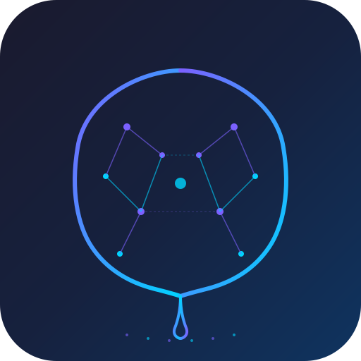
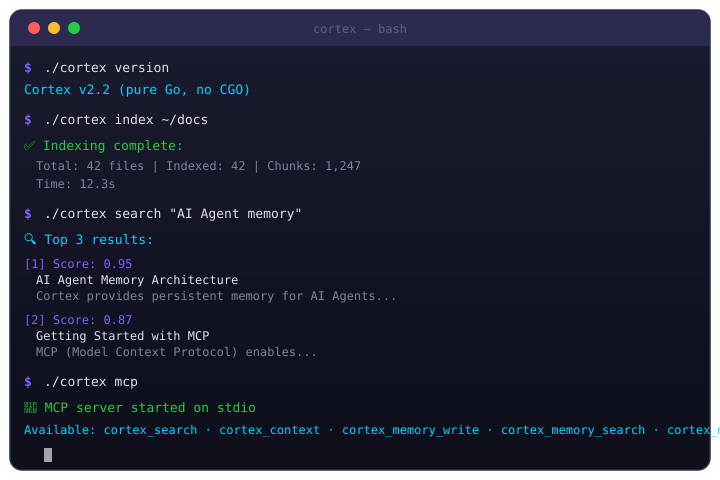

<p align="center">
  
</p>

<p align="center">
  
  
  
  
  
  
  
  
</p>

<h1 align="center">🧠 Cortex</h1>
<h3 align="center">AI Agent 的第二大脑 — 本地知识库 · 单二进制 · MCP 原生</h3>

<p align="center">
  <b>Cortex</b> 是一个为 AI Agent 设计的本地知识库引擎。单二进制文件部署，原生支持 <b>MCP 协议</b>，内置<b>混合搜索</b>（向量+BM25）和<b>Agent 记忆系统</b>。100% 本地运行，零外部依赖。
</p>
<p align="center">
  给 Claude Code、OpenCode 等 AI Agent 装上永久记忆 🧠
</p>
<p align="center">
  <a href="https://github.com/lh123aa/cortex"><b>GitHub 仓库</b></a> ·
  <a href="https://lh123aa.github.io/cortex/"><b>🎨 营销落地页</b></a> ·
  <a href="docs/index.html"><b>本地预览</b></a> ·
  <a href="docs/promotion/juejin-article.md"><b>📖 深度技术文章</b></a>
</p>

<p align="center">
  <a href="docs/index.html">
    
  </a>
  <br>
  <sub>⬆️ 点击查看完整营销落地页（小米/Mimo 风格）</sub>
</p>

<p align="center">
  <a href="#-产品对比">📊 产品对比</a> ·
  <a href="#-快速开始">⚡ 快速开始</a> ·
  <a href="#-核心特性">✨ 核心特性</a> ·
  <a href="#-系统架构">🏗️ 系统架构</a> ·
  <a href="#-rest-api">📡 API</a> ·
  <a href="#-配置">🔧 配置</a>
  <br>
  <a href="./README.en.md">🌐 English Version</a> ·
  <a href="#-开发">🛠️ 开发</a> ·
  <a href="./docs">📖 文档</a>
</p>

---

## 📊 产品对比

<table>
<thead>
<tr>
  <th>功能</th>
  <th align="center">🚀 Cortex</th>
  <th align="center">Mem0</th>
  <th align="center">AnythingLLM</th>
  <th align="center">ChromaDB</th>
  <th align="center">Qdrant</th>
  <th align="center">Dify</th>
</tr>
</thead>
<tbody>
<tr>
  <td colspan="7"><strong>📦 部署</strong></td>
</tr>
<tr>
  <td>部署方式</td>
  <td align="center">✅ <strong>单二进制</strong><br><sub>下载即用</sub></td>
  <td align="center">⚠️ pip/Docker<br><sub>需 Python 环境</sub></td>
  <td align="center">⚠️ Docker/Desktop<br><sub>需 Node.js</sub></td>
  <td align="center">⚠️ pip/Docker<br><sub>需 Python</sub></td>
  <td align="center">✅ <strong>单二进制</strong><br><sub>下载即用</sub></td>
  <td align="center">⚠️ Docker Compose<br><sub>多服务部署</sub></td>
</tr>
<tr>
  <td>外部依赖</td>
  <td align="center">✅ <strong>零依赖</strong><br><sub>可选 Ollama</sub></td>
  <td align="center">❌ 需 LLM API</td>
  <td align="center">❌ 需 LLM API</td>
  <td align="center">✅ 无</td>
  <td align="center">✅ 无</td>
  <td align="center">❌ 多服务</td>
</tr>
<tr>
  <td colspan="7"><strong>🤖 AI Agent 集成</strong></td>
</tr>
<tr>
  <td>MCP 协议原生</td>
  <td align="center">✅ <strong>原生支持</strong><br><sub>cortex mcp</sub></td>
  <td align="center">⚠️ 插件集成</td>
  <td align="center">✅ 支持</td>
  <td align="center">❌ 不支持</td>
  <td align="center">❌ 不支持</td>
  <td align="center">✅ 支持</td>
</tr>
<tr>
  <td>MCP 工具数</td>
  <td align="center">🔧 <strong>5 个</strong><br><sub>搜索/上下文/记忆</sub></td>
  <td align="center">🔧 1-2 个</td>
  <td align="center">🔧 1 个</td>
  <td align="center">—</td>
  <td align="center">—</td>
  <td align="center">🔧 1-2 个</td>
</tr>
<tr>
  <td>Agent 记忆系统</td>
  <td align="center">✅ <strong>内置</strong><br><sub>长期记忆+RAG</sub></td>
  <td align="center">✅ <strong>专注</strong><br><sub>多层记忆</sub></td>
  <td align="center">❌ 仅对话</td>
  <td align="center">❌ 向量库</td>
  <td align="center">❌ 向量库</td>
  <td align="center">⚠️ 基础记忆</td>
</tr>
<tr>
  <td colspan="7"><strong>🔍 搜索</strong></td>
</tr>
<tr>
  <td>搜索类型</td>
  <td align="center">✅ <strong>混合搜索</strong><br><sub>向量+BM25+RRF</sub></td>
  <td align="center">✅ 混合搜索</td>
  <td align="center">✅ 向量搜索</td>
  <td align="center">✅ 向量/混合</td>
  <td align="center">✅ 混合搜索</td>
  <td align="center">⚠️ 依赖后端</td>
</tr>
<tr>
  <td>文件格式</td>
  <td align="center">📄 <strong>MD/PDF/DOCX</strong><br><sub>+代码文件</sub></td>
  <td align="center">— <sub>纯记忆</sub></td>
  <td align="center">✅ <strong>多格式</strong></td>
  <td align="center">— <sub>纯向量</sub></td>
  <td align="center">— <sub>纯向量</sub></td>
  <td align="center">✅ 多格式</td>
</tr>
<tr>
  <td colspan="7"><strong>📊 运维</strong></td>
</tr>
<tr>
  <td>内置监控</td>
  <td align="center">✅ <strong>Prometheus</strong><br><sub>39 指标</sub></td>
  <td align="center">⚠️ Dashboard</td>
  <td align="center">⚠️ 基础</td>
  <td align="center">❌ 无</td>
  <td align="center">❌ 无</td>
  <td align="center">✅ Grafana</td>
</tr>
<tr>
  <td>缓存加速</td>
  <td align="center">✅ <strong>L1+L2 两级</strong><br><sub>内存+SQLite</sub></td>
  <td align="center">⚠️ 基础缓存</td>
  <td align="center">⚠️ 基础缓存</td>
  <td align="center">❌ 无</td>
  <td align="center">✅ 内存</td>
  <td align="center">⚠️ 基础</td>
</tr>
<tr>
  <td>隐私保护</td>
  <td align="center">✅ <strong>完全本地</strong><br><sub>100% 离线</sub></td>
  <td align="center">⚠️ 本地/云</td>
  <td align="center">✅ 完全本地</td>
  <td align="center">✅ 完全本地</td>
  <td align="center">✅ 完全本地</td>
  <td align="center">⚠️ 本地/云</td>
</tr>
<tr>
  <td>开源协议</td>
  <td align="center">✅ <strong>MIT</strong><br><sub>商用自由</sub></td>
  <td align="center">✅ Apache 2.0</td>
  <td align="center">✅ MIT</td>
  <td align="center">✅ Apache 2.0</td>
  <td align="center">✅ Apache 2.0</td>
  <td align="center">⚠️ 附加条款</td>
</tr>
</tbody>
</table>

> **Cortex 的核心差异化**：它是唯一一个同时具备「单二进制部署 + MCP 原生 + 内置记忆系统 + 混合搜索 + Prometheus 监控」的工具，专为 AI Agent 场景设计。

---

## 🎯 适用场景

| 场景 | 说明 |
|------|------|
| 🤖 **AI Agent 记忆** | 让 Claude Code / OpenCode / Cursor 等 Agent 跨会话记住用户偏好和历史 |
| 📚 **团队知识库** | 将团队 Wiki、技术文档、项目规范索引为可搜索的 RAG 知识库 |
| 🔍 **代码库语义搜索** | 索引 Go/Python/JS 等代码，用自然语言搜索函数、类和实现 |
| 🏢 **企业内部文档** | 员工手册、产品文档、培训材料的本地私密检索，数据不出内网 |
| 🧪 **RAG 应用后端** | 作为 RAG pipeline 的检索层，提供 REST API 和 MCP 双协议接入 |
| 🔐 **隐私敏感场景** | 金融、医疗、法律等需要 100% 本地部署的知识管理需求 |

---

## ✨ 更新日志

### 🧠 v2.2 MCP 记忆工具 (2026-05-05)

- ✅ **5 个 MCP 工具** — `cortex_search` / `cortex_context` / `cortex_memory_write` / `cortex_memory_search` / `cortex_memory_delete`
- ✅ **嵌入式零依赖模式** — `embedding.provider: none`，无需 Ollama，FTS5 全文搜索
- ✅ **纯 Go SQLite 驱动** — 改用 `modernc.org/sqlite`，无需 CGO/gcc，`go build` 即用
- ✅ **MCP 优雅关闭** — Signal 处理，Ctrl+C 安全退出
- ✅ **MCP 单元测试** — 11 个测试用例，覆盖全部工具边界条件

### 🔥 v2.1 生产环境修复 (2026-04-25)

- ✅ **L1+L2 两级缓存** — 内存 + SQLite 缓存，搜索速度提升 10x
- ✅ **Graceful Shutdown** — 优雅关闭，30s 内处理完现有请求
- ✅ **请求超时控制** — 默认 30s，搜索 60s，索引 5min
- ✅ **API 限流** — 令牌桶算法，100 req/s，突发 200
- ✅ **36 个测试用例** — 覆盖存储/认证/搜索核心模块

### ✨ v2.0 核心功能

- ✅ **记忆系统 API** — 完整的记忆写入/搜索/上下文/删除接口
- ✅ **认证持久化** — 用户/Token/APIKey 存储到 SQLite，重启不丢失
- ✅ **Prometheus 监控** — 39 个指标，端口 9090

---

## ⚡ 快速开始

```bash
# 1. 下载二进制
# macOS/Linux
curl -fsSL https://github.com/lh123aa/cortex/releases/latest/download/cortex-linux-amd64.zip | unzip -
chmod +x cortex

# Windows
# Invoke-WebRequest -Uri "..." -OutFile "cortex.zip"

# 2. 索引文档
cortex index ~/my-docs

# 3. 启动 MCP 服务器（供 AI Agent 使用）
cortex mcp

# 4. 搜索
cortex search "如何实现 Go 并发"
```

---

## ✨ 核心特性

<div align="center">
<table>
<tr>
<td align="center" width="33%">
<h3>🚀 单二进制</h3>
<p><sub>下载即运行，无 Python/Node/Docker 依赖<br><code>curl → cortex mcp</code></sub></p>
</td>
<td align="center" width="33%">
<h3>🔌 MCP 原生</h3>
<p><sub>5 个 MCP 工具，AI Agent 开箱即用<br><code>cortex_search</code> · <code>cortex_memory_write</code></sub></p>
</td>
<td align="center" width="33%">
<h3>🧠 记忆系统</h3>
<p><sub>长期记忆 + RAG 上下文<br>Agent 跨会话记住用户偏好</sub></p>
</td>
</tr>
<tr>
<td align="center" width="33%">
<h3>🔍 混合搜索</h3>
<p><sub>向量语义 + BM25 关键词<br>RRF 融合排序，精准召回</sub></p>
</td>
<td align="center" width="33%">
<h3>⚡ L1+L2 缓存</h3>
<p><sub>内存 + SQLite 两级缓存<br>搜索速度提升 10x</sub></p>
</td>
<td align="center" width="33%">
<h3>📊 Prometheus</h3>
<p><sub>39 个监控指标<br><code>:9090/metrics</code></sub></p>
</td>
</tr>
</table>
</div>

### 🔌 MCP 工具一览

| 工具 | 说明 | 对应 REST API |
|------|------|--------------|
| `cortex_search` | 混合搜索（向量 + BM25） | `GET /v1/search` |
| `cortex_context` | RAG 上下文组装 | `GET /v1/context` |
| `cortex_memory_write` | 写入记忆条目 | `POST /v1/memory` |
| `cortex_memory_search` | 搜索记忆条目 | `GET /v1/memory/search` |
| `cortex_memory_delete` | 删除记忆条目 | `DELETE /v1/memory/:id` |

---

## 🏗️ 系统架构

```
┌──────────────────────────────────────────────────────────┐
│                      Cortex CLI                          │
├──────────────────────────────────────────────────────────┤
│  index  │  search  │  context  │  serve  │     mcp       │
├──────────────────────────────────────────────────────────┤
│                  混合搜索引擎                              │
│      向量搜索 (HNSW)     │      FTS5 (BM25)              │
├──────────────────────────────────────────────────────────┤
│               L1+L2 两级缓存 (v2.1)                       │
│          go-cache (内存)   │     SQLite                   │
├──────────────────────────────────────────────────────────┤
│                    SQLite 存储层                           │
│    文档表   │  分块表   │  向量表   │  缓存表   │  用户表  │
├──────────────────────────────────────────────────────────┤
│                  MCP 协议 · REST API                      │
│     5 个 MCP 工具  │  15+ REST 端点  │  Prometheus       │
└──────────────────────────────────────────────────────────┘
```

**技术栈：**
- **语言**: Go 1.21+ — 单二进制跨平台（纯 Go，无 CGO）
- **存储**: SQLite + WAL — 零配置嵌入式存储
- **向量**: HNSW — 高性能近似最近邻搜索
- **嵌入**: Ollama / ONNX / None（FTS5-only）
- **协议**: MCP SDK — AI Agent 原生通信
- **监控**: Prometheus — 39 个内置指标

---

## 📡 REST API

| 类别 | 端点 | 方法 | 说明 |
|------|------|------|------|
| **搜索** | `/v1/search` | GET | 混合搜索（向量 + FTS） |
| | `/v1/context` | GET | RAG 上下文构建 |
| **记忆** | `/v1/memory` | POST | 写入单条记忆 |
| | `/v1/memory/batch` | POST | 批量写入记忆 |
| | `/v1/memory/search` | GET | 搜索记忆 |
| | `/v1/memory/context` | GET | 记忆 RAG 上下文 |
| | `/v1/memory/:id` | DELETE | 删除记忆 |
| **认证** | `/auth/register` | POST | 注册用户 |
| | `/auth/login` | POST | 登录 |
| | `/auth/logout` | POST | 登出 |
| **监控** | `/health` | GET | 健康检查 |
| | `/metrics` | GET | Prometheus 指标（:9090） |

---

## 🔧 配置

```yaml
# ~/.cortex/config.yaml
cortex:
  db_path: ~/.cortex/cortex.db
  log_level: info
  auth_enabled: false

embedding:
  provider: ollama    # ollama | onnx | none（FTS5-only，无需外部服务）
  ollama:
    base_url: http://localhost:11434
    model: nomic-embed-text

index:
  workers: 8
  max_tokens: 512

search:
  cache_ttl: 5m
  default_top_k: 10

prometheus:
  enabled: true
  port: 9090
```

---

## 📦 支持的文件格式

| 格式 | 支持 | 分块方式 |
|------|------|---------|
| Markdown (.md) | ✅ | 层级分块，标题路径追溯 |
| PDF (.pdf) | ✅ | 文本提取，自动分块 |
| Word (.docx) | ✅ | 段落解析，结构保持 |
| 纯文本 (.txt) | ✅ | 按行/段落分块 |
| 代码 (.go/.py/.js/.ts/.java 等) | ✅ | 按函数/类分块 |
| 配置 (.yaml/.json/.toml/.ini) | ✅ | 结构化提取 |

---

## 🛠️ 开发

```bash
git clone https://github.com/lh123aa/cortex.git
cd cortex
go build -o cortex ./cmd/cortex   # 纯 Go，无需 CGO
./cortex serve
go test ./...                     # 114 个测试
```

---

## 📊 性能

| 指标 | 值 |
|------|-----|
| 搜索延迟 P50 | < 50ms（缓存命中 < 1ms） |
| 搜索延迟 P95 | < 100ms |
| 缓存命中率 | > 60%（L1+L2 两级） |
| 索引吞吐量 | > 100 files/min |
| 测试覆盖率 | 114 个单元测试 |

---

## 🤝 贡献

- 🐛 发现 Bug？[提交 Issue](https://github.com/lh123aa/cortex/issues)
- 💡 有好想法？[讨论区](https://github.com/lh123aa/cortex/discussions)
- ⭐ 项目对你有帮助？点个 Star 支持

## 📄 许可证

**MIT License** — 可自由使用、修改、商业化。

---

## ⭐ Star History

[](https://star-history.com/#lh123aa/cortex&Date)

---

## 💬 社区 & 支持

- ⭐ **给个 Star** — 支持项目最好的方式
- 🐛 **报告 Bug** — [提交 Issue](https://github.com/lh123aa/cortex/issues)
- 💡 **功能建议** — [发起 Discussion](https://github.com/lh123aa/cortex/discussions)
- 📣 **分享推荐** — 在掘金、知乎、V2EX 推荐 Cortex
- 🤝 **贡献代码** — 阅读 [CONTRIBUTING.md](CONTRIBUTING.md)

## 🔗 相关资源

- [MCP 协议规范](https://modelcontextprotocol.io) — AI Agent 通信标准
- [Ollama](https://ollama.ai) — 本地 LLM & Embedding
- [OpenCode](https://opencode.ai) — AI Agent 框架
- [Awesome MCP Servers](https://github.com/lh123aa/awesome-mcp-servers) — MCP 服务器资源列表

---

<p align="center">
  <strong>🧠 Cortex v2.2 — 让 AI Agent 拥有记忆</strong>
  <br>
  <sub>单二进制 · 零配置 · MCP 原生 · 完全本地 · MIT 开源</sub>
</p>

<p align="center">
  <a href="https://github.com/lh123aa/cortex/stargazers">
    
  </a>
  <a href="https://github.com/lh123aa/cortex/forks">
    
  </a>
  <a href="https://github.com/lh123aa/cortex">
    
  </a>
</p>
